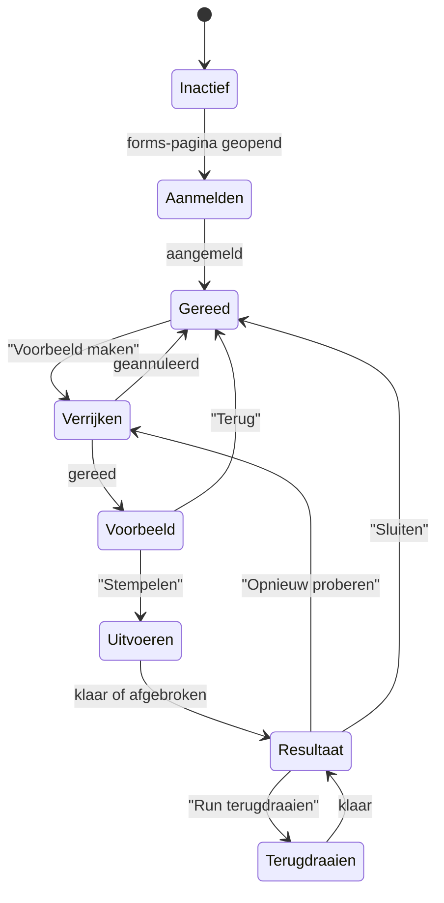

# UX-startdocument

Vertrekpunt voor het ontwerp van de extensie. Beschrijft de toestanden die de
tool kan hebben, en per toestand wat de gebruiker ziet en moet invoeren.

Dit is een functionele beschrijving, geen visueel ontwerp. Wat er staat, ligt
vast; hoe het eruitziet niet. Waar een keuze nog open is, staat dat er expliciet
bij — die vragen horen bij het ontwerp beantwoord te worden, niet stilzwijgend.

Achtergrond: [`workflow.md`](workflow.md) (wat de tool doet en waarom),
[`api-notes.md`](api-notes.md) (de API-kant).

## Uitgangspunten

Vier dingen bepalen de vorm meer dan wat dan ook:

1. **De tool is een paneel binnen ACC Build, geen eigen applicatie.** De
   gebruiker is al ergens mee bezig; het paneel komt daarbij, en verdwijnt weer.
2. **De selectie gebeurt in ACC zelf.** Het paneel toont nooit een eigen
   formulierenlijst met eigen filters. Filteren, zoeken en aanvinken doet de
   gebruiker in de lijst die hij al kent. Bouwen we dat na, dan hebben we de
   ACC-UI opnieuw gebouwd en zijn we het punt van de extensie kwijt.
3. **Er wordt nooit geschreven zonder dat de gebruiker het heeft gezien.** Het
   voorbeeldscherm is geen bevestigingsvraag maar een werkelijke vergelijking:
   dit staat er nu, dit komt er te staan.
4. **Alles is terug te draaien.** Dat moet zichtbaar zijn op het moment dat het
   spannend wordt, niet weggestopt in een menu.

De gebruiker is een werkvoorbereider of uitvoerder, geen ontwikkelaar. Termen als
"asset" en "formulier" kent hij; "API", "relatie" en "endpoint" niet.

## Toestanden

Vijf schermen dus, plus twee dialogen. Niet meer.

---

### 1. Inactief

De gebruiker zit niet op een formulierenpagina.

Het paneel toont zichzelf niet, of hooguit als ingeklapt icoon. Geen melding,
geen uitleg, geen knop. Wie hier niets aan het doen is, hoeft niets te lezen.

**Invoer:** geen.

---

### 2. Aanmelden

Eenmalig, en daarna pas weer als het token verloopt.

| Element | Type | Verplicht | Gedrag |
|---|---|---|---|
| Uitleg in één zin | Tekst | — | Waarom aanmelden nodig is: de tool werkt namens jou, met jouw rechten |
| **Aanmelden bij Autodesk** | Knop, primair | **Ja** | Opent de OAuth-flow |

Eén zin uitleg is genoeg. De gebruiker is al in ACC ingelogd en snapt niet
vanzelf waarom het nog een keer moet — leg dat kort uit ("zodat de tool alleen
mag wat jij mag"), niet in een alinea.

**Fout:** aanmelden mislukt of afgebroken → blijf op dit scherm, toon wat er
misging in gewone taal, met dezelfde knop opnieuw beschikbaar.

---

### 3. Gereed

Het rustpunt. Hier komt de gebruiker terug na elke run.

| Element | Type | Verplicht | Gedrag |
|---|---|---|---|
| Selectieteller | Tekst, live | — | "12 formulieren geselecteerd". Werkt mee terwijl de gebruiker in ACC aanvinkt |
| **Voorbeeld maken** | Knop, primair | **Ja** | Uitgeschakeld bij 0 geselecteerd |
| Instellingen | Link of icoon | Nee | Naar afmelden, en naar het journaal van eerdere runs |

**De selectieteller is het belangrijkste element van dit scherm.** Hij is de
enige bevestiging dat het paneel meekijkt met wat de gebruiker in ACC doet.
Blijft die op nul staan terwijl er wel iets is aangevinkt, dan is de tool kapot
en moet dat hier blijken — niet drie schermen verderop.

Bij 0 geselecteerd: vertel wat de gebruiker moet doen ("vink formulieren aan in
de lijst"), en zet de knop uit in plaats van hem te verbergen.

#### Gesloten formulieren

De schakelaar *Gesloten formulieren meenemen* (standaard uit) kan gebouwd worden:
heropenen via de API werkt, gemeten op 27-07-2026.

Maar hij vraagt meer dan een aantal bevestigen. Bij het opnieuw sluiten
overschrijft ACC "gesloten door" en "gesloten op" met de uitvoerende gebruiker en
het moment van nu, en **dat is niet terug te draaien** — ook niet door onze
terugdraaiactie. Voor deze formulieren geldt uitgangspunt 4 hierboven dus maar
half.

Dat hoort te staan waar de keuze gemaakt wordt, in gewone taal:

> Bij deze formulieren komt jouw naam en de datum van vandaag te staan als wie ze
> heeft afgerond. Dat kan niet ongedaan gemaakt worden.

Niet als waarschuwingsdriehoek naast de schakelaar, maar als de tekst die de
schakelaar uitlegt. En in het voorbeeldscherm de gesloten rijen apart zichtbaar
met hun aantal, zodat het bij de laatste klik nog een keer langskomt.

---

### 4. Verrijken

Bezig met ophalen: gekoppelde assets per formulier, assetnamen, de
categorieboom. Duurt merkbaar lang bij een grote selectie — de relatieservice
neemt maximaal 20 formulieren per aanroep.

| Element | Type | Verplicht | Gedrag |
|---|---|---|---|
| Voortgang | Balk of teller | — | "24 van de 120 formulieren" — in formulieren, niet in procenten of aanroepen |
| **Annuleren** | Knop, secundair | **Ja** | Terug naar Gereed. Veilig: er is nog niets geschreven |

Zeg hier ergens dat er nog niets gewijzigd wordt. Dat is precies waar de
gebruiker bij een lange laadtijd onzeker over wordt.

---

### 5. Voorbeeld

Het scherm waar het om draait. Alles wat de tool gaat doen, staat hier vóór er
één aanroep is gedaan.

Per formulier een rij:

| Kolom | Inhoud |
|---|---|
| Selectievakje | Aan/uit, standaard aan |
| Formulier | Naam en nummer, zoals in ACC |
| Nu | Huidige notities |
| Straks | Voorgestelde notities, met het gewijzigde blok gemarkeerd |
| Signaal | Alleen als er iets aan de hand is (zie hieronder) |

Formulieren waarbij niets verandert, horen hier **niet** tussen de rest. Zet ze
apart weg als "8 formulieren zijn al bijgewerkt — geen wijziging nodig",
ingeklapt. Ze zijn geruststellend om te kunnen zien, maar ze leiden af van de
rijen waar het werkelijk om gaat.

**Verplichte melding: de tekst is onzichtbaar, maar wel vindbaar**

Dit scherm moet uitleggen wat het stempel wél en niet doet. Waargenomen in de
praktijk: bij een sjabloon zonder notitieblok komt de tekst nergens op het
formulier te staan, terwijl het formulier daarna wel te vinden is via
**Filters → Opmerkingen** in het formulieroverzicht.

Zonder die uitleg gaat de gebruiker op het formulier kijken, ziet niets, en
concludeert dat de tool niet werkt. Of erger: hij stempelt nog een keer.

Eén regel volstaat, zoiets als:

> De assets komen in het notitieveld. Afhankelijk van het sjabloon is dat veld
> niet zichtbaar op het formulier zelf — je vindt de formulieren daarna terug via
> **Filters → Opmerkingen** in het overzicht.

Toon die vaste tekst bij het voorbeeld, en herhaal hem op het resultaatscherm.
Daar is het namelijk het moment waarop iemand gaat controleren of het gelukt is.

Als later blijkt dat via `include=layoutInfo` per sjabloon op te vragen is of het
notitieblok aan staat (zie `api-notes.md`), maak er dan een signaal per rij van
in plaats van een algemene mededeling. Dat is preciezer, maar de algemene tekst
is sowieso nodig.

**Signalen die een rij kan hebben:**

| Signaal | Betekenis | Gevolg |
|---|---|---|
| Geen assets | Formulier heeft geen gekoppelde assets | Rij standaard **uit**; stempelen zou een lege lijst schrijven |
| Bijna vol | Notities lopen tegen de 8000 tekens | Toon welke verkorting is toegepast (zie `workflow.md`) |
| ~~PDF-formulier~~ | ~~Niet te bewerken via de API~~ | **Vervallen.** Gemeten op 27-07-2026: PDF-formulieren zijn gewoon te stempelen. Geen signaal nodig |
| Gesloten | Wordt heropend en weer gesloten | Rij uit tenzij de schakelaar aan staat; zichtbaar apart geteld, want hier gaat historie verloren |
| Tekst onder het blok | Gaat verloren bij stempelen | Rij aan, maar zichtbaar gewaarschuwd |

Die laatste is de enige waarbij de tool iets van de gebruiker weggooit. Maak dat
zichtbaar in de rij zelf, niet alleen in een teller bovenaan.

**Besturingselementen:**

| Element | Type | Verplicht | Gedrag |
|---|---|---|---|
| Selectievakje per rij | Aan/uit | Nee | Standaard aan, behalve bij "geen assets" |
| Alles aan/uit | Aan/uit | Nee | Werkt op wat zichtbaar is |
| **Stempelen** | Knop, primair | **Ja** | Label noemt het aantal: "12 formulieren stempelen". Uit bij 0 |
| **Terug** | Knop, secundair | **Ja** | Terug naar Gereed, zonder iets te doen |

Het aantal hoort **in het label van de knop**, niet ernaast. Dat is het laatste
wat iemand leest voor hij klikt.

---

### 6. Uitvoeren

Nu wordt er geschreven.

| Element | Type | Verplicht | Gedrag |
|---|---|---|---|
| Voortgang | Balk of teller | — | "7 van de 12" |
| Lopende regel | Tekst | — | Welk formulier nu aan de beurt is |
| Fouten onderweg | Teller | — | "1 mislukt" — zichtbaar tijdens de run, niet pas achteraf |
| **Stoppen** | Knop, secundair | **Ja** | Maakt het lopende formulier af en stopt daarna |

Fouten stoppen de run niet (zie `workflow.md`). Ze horen wel meteen zichtbaar te
zijn, zodat iemand kan ingrijpen bij een run van driehonderd formulieren die er
tweehonderd gaat verprutsen.

"Stoppen" is geen "ongedaan maken": wat geschreven is, blijft staan. Zeg dat op
de knop of ernaast, anders wordt het verkeerd begrepen.

---

### 7. Resultaat

| Element | Type | Verplicht | Gedrag |
|---|---|---|---|
| Samenvatting | Tekst | — | Gestempeld / overgeslagen / mislukt, met aantallen |
| Foutenlijst | Lijst | — | Per formulier wat er misging, in gewone taal |
| **Opnieuw proberen** | Knop | Alleen bij fouten | Alleen de mislukte formulieren |
| **Run terugdraaien** | Knop | **Ja** | Opent de bevestigingsdialoog |
| **Sluiten** | Knop | **Ja** | Terug naar Gereed |

Bij een volledig geslaagde run mag dit scherm kort zijn. Maar **"Run
terugdraaien" hoort er ook dan te staan** — juist dan. Iemand die net
tweehonderd formulieren heeft gestempeld en twijfelt, moet niet hoeven zoeken.

---

### Dialoog A — Terugdraaien bevestigen

| Element | Type | Verplicht | Gedrag |
|---|---|---|---|
| Wat er gebeurt | Tekst | — | "De notities van 12 formulieren gaan terug naar hoe ze waren" |
| Omvang | Keuze | **Zie hieronder** | Alleen notities, of ook de status |
| **Terugdraaien** | Knop, primair | **Ja** | Voert uit |
| **Annuleren** | Knop, secundair | **Ja** | Sluit de dialoog |

**Ontwerpbesluit, nu de meting er is.** De status is terug te zetten, de
sluitgegevens niet — "gesloten door" en "gesloten op" zijn bij het opnieuw
sluiten al overschreven en blijven dat.

Daarmee valt de keuze weg: laat de gebruiker niet kiezen tussen twee soorten
terugdraaien waarvan er één toch niet volledig is. De tool zet notities én status
terug, en de dialoog zegt erbij wat er blijft staan:

> De notities en de status gaan terug naar hoe ze waren. Wie de formulieren heeft
> afgerond en wanneer, blijft staan zoals het nu is — dat is niet meer te
> herstellen.

Alleen tonen als de run gesloten formulieren heeft aangeraakt. Bij een gewone run
is er niets onherstelbaars en hoort die zin er niet te staan.

### Dialoog B — Fout die de run blokkeert

Voor het geval er iets misgaat waar de gebruiker zelf niets aan kan doen:
token verlopen, geen rechten, ACC onbereikbaar.

Eén melding in gewone taal, één handeling (opnieuw aanmelden, of opnieuw
proberen), en de garantie erbij wat er wél en niet al geschreven is.

---

## Gebruikersinvoer in het kort

Alles wat de tool ooit van de gebruiker vraagt:

| Invoer | Waar | Verplicht | Standaard |
|---|---|---|---|
| Aanmelden bij Autodesk | Aanmelden | Ja, eenmalig | — |
| Formulieren aanvinken | **In ACC zelf** | Ja | Leeg |
| Voorbeeld maken | Gereed | Ja | — |
| Rijen uitsluiten | Voorbeeld | Nee | Alles aan, behalve "geen assets" |
| Stempelen bevestigen | Voorbeeld | Ja | — |
| Annuleren / stoppen | Verrijken, Uitvoeren | Nee | — |
| Opnieuw proberen | Resultaat | Nee | — |
| Terugdraaien | Resultaat + dialoog | Nee | — |
| Gesloten formulieren meenemen | Gereed | Nee | Uit |

Dat is de hele lijst. Twee verplichte klikken in de gelukkige route: *Voorbeeld
maken* en *Stempelen*. Wordt dat er meer, dan is er iets misgegaan in het
ontwerp.

Wat de tool **niet** vraagt, en ook niet moet gaan vragen: het project (staat in
de URL), het stempelformaat (ligt vast), de datum (is vandaag), of de gebruiker
het zeker weet (daar is het voorbeeldscherm voor).

## Randgevallen

| Situatie | Gedrag |
|---|---|
| Gebruiker wijzigt de selectie in ACC terwijl het paneel op Voorbeeld staat | Voorbeeld blijft staan en verwijst naar de selectie waarmee het gemaakt is. Meld dat de selectie inmiddels is gewijzigd, met een knop om opnieuw te bepalen |
| Selectie is heel groot (honderden) | Waarschuw vóór het verrijken, met een indicatie van de duur |
| Alle rijen uitgevinkt in Voorbeeld | Knop uit, met uitleg waarom |
| Formulier is tussen voorbeeld en uitvoeren gewijzigd door iemand anders | Behandelen als fout op die rij; niet de hele run afbreken |
| Token verloopt tijdens een run | Run pauzeert, gebruiker meldt opnieuw aan, run gaat verder — geen werk kwijt |
| Paneel wordt gesloten tijdens een run | Vraag om bevestiging; laat de run gewoon doorlopen |

## Toon

Nederlands, en de taal van de bouwplaats — niet die van de API. "Gekoppelde
assets", niet "relaties". "Bijwerken", niet "patchen". Foutmeldingen zeggen wat
er is misgegaan en wat de gebruiker eraan kan doen; een statuscode helpt hem
niet.

Wees zuinig met waarschuwen. Als alles een uitroepteken krijgt, valt de ene rij
waar het echt om gaat niet meer op.

## Wat het ontwerp moet beantwoorden

1. Hoe ziet het verschil tussen "nu" en "straks" eruit in een rij, als de
   notities lang zijn? Dat is het lastigste onderdeel van het hele scherm.
2. Waar zit het paneel — vast aan een rand, zwevend, of ingeklapt tot een knop?
   Het mag de lijst niet afdekken, want daar staat de selectie in.
3. Hoe ziet de teller eruit bij nul geselecteerd, zonder dat het een foutmelding
   lijkt?
4. Werkt het voorbeeld ook bij 300 rijen, of is er dan iets anders nodig?
